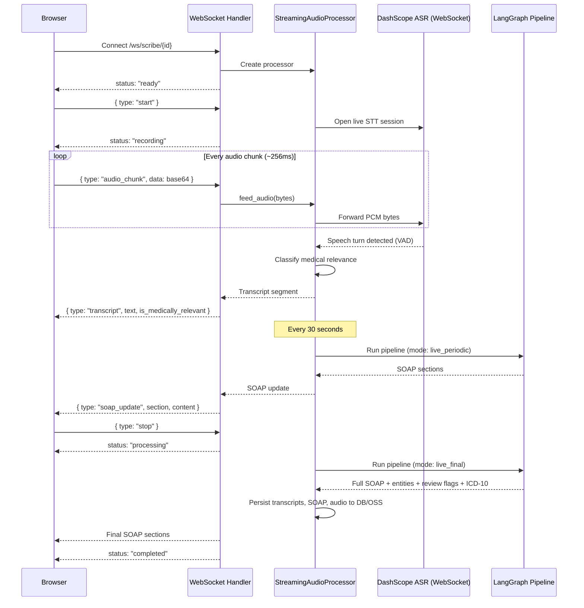
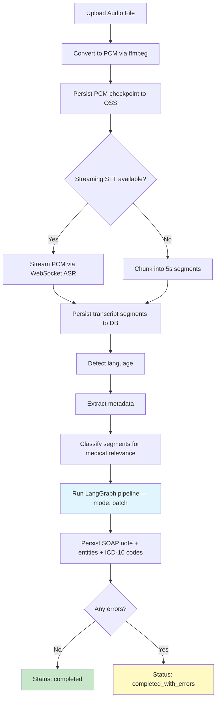
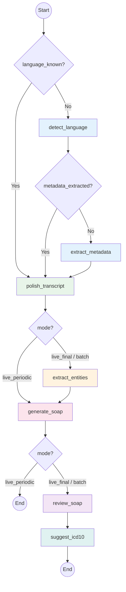

# AI Architecture

Tocky transforms raw audio from clinical consultations into structured SOAP notes through a multi-stage AI pipeline. Audio enters the system via two paths — real-time WebSocket streaming or batch file upload — both of which converge on a shared [LangGraph](https://langchain-ai.github.io/langgraph/) state graph that orchestrates language detection, transcript polishing, medical entity extraction, two-pass SOAP generation, QA review, and ICD-10 code suggestion.

## Processing Modes

### Real-Time (WebSocket)

The client streams base64-encoded PCM audio chunks over WebSocket at `/ws/scribe/{consultation_id}`. The server creates a `StreamingAudioProcessor` which opens a persistent WebSocket to DashScope's real-time ASR service for speech-to-text.

Server-side Voice Activity Detection (VAD) segments the audio into speech turns. Each turn produces a transcript segment that is classified for medical relevance. The system detects the source language on the first segment and every 10th segment thereafter, dynamically adjusting VAD parameters per language. Metadata extraction (consultation title, patient identifier) triggers after 3 medically relevant segments.

SOAP notes are updated every 30 seconds using the `live_periodic` pipeline mode (fast path — skips entity extraction, QA review, and ICD-10). When the doctor stops recording, a comprehensive `live_final` pipeline run produces the final SOAP note with all processing stages.

If the streaming STT WebSocket fails, the processor falls back to batch transcription of buffered 5-second PCM chunks.



### Batch (File Upload)

The client uploads an audio file via `POST /consultations/{id}/upload-audio`. The server converts it to 16kHz 16-bit mono PCM using ffmpeg, persists the PCM to OSS as a checkpoint (for retry support), then runs the transcription pipeline.

Transcription uses streaming STT (preferred) or fixed 5-second chunking (legacy fallback). Each segment is persisted to the database as it arrives. After transcription, the system detects the language, extracts metadata, classifies each segment for medical relevance, then runs the full `batch` LangGraph pipeline.

Progress is streamed to the client via Server-Sent Events (SSE) at `/api/v1/consultations/{id}/events`. Failed processing can be resumed via `POST /{id}/retry-processing`, which re-runs from the PCM checkpoint.



## LangGraph Pipeline

The core orchestration lives in `apps/api/app/services/graph/`. A LangGraph `StateGraph` routes audio processing through up to 7 nodes depending on the execution mode.

### State

`ScribePipelineState` (TypedDict) carries all data through the graph:

**Inputs:**
| Field | Type | Description |
|-------|------|-------------|
| `consultation_id` | UUID | Tracking identifier |
| `relevant_text` | str | Pre-joined medically relevant transcript segments |
| `language` | str | User-specified or detected language code |
| `language_known` | bool | Skip language detection if `True` |
| `metadata_extracted` | bool | Skip metadata extraction if `True` |
| `mode` | str | `live_periodic`, `live_final`, or `batch` |

**Intermediate (populated by nodes):**
| Field | Type | Description |
|-------|------|-------------|
| `detected_language` | str | Language code (vi, ar-eg, ar-gulf, en, fr) |
| `consultation_metadata` | dict | `{title, patient_identifier}` |
| `polished_transcript` | str | Grammar/medical term corrections applied |
| `medical_entities` | dict | `{symptoms, diagnoses, medications, procedures, vitals, allergies}` |
| `soap` | dict | `{subjective, objective, assessment, plan}` |
| `confidence_flags` | list | Low-confidence annotations from generation |
| `review_flags` | list | QA flags from SOAP review |
| `icd10_codes` | list | Suggested diagnostic codes |
| `errors` | list | Soft-fail error accumulator `[{node, error}]` |

### Nodes

| Node | Purpose | AI Method | Reads | Writes |
|------|---------|-----------|-------|--------|
| `detect_language` | Identify source language | `detect_language()` | `relevant_text` | `detected_language` |
| `extract_metadata` | Extract title + patient ID | `extract_consultation_metadata()` | `relevant_text` | `consultation_metadata` |
| `polish_transcript` | Fix ASR errors, merge fragments, correct medical terms | `polish_transcript()` | `relevant_text`, `language` | `polished_transcript` |
| `extract_entities` | NER for symptoms, diagnoses, meds, procedures, vitals, allergies | `extract_medical_entities()` | `polished_transcript`, `language` | `medical_entities` |
| `generate_soap` | Two-pass S/O extraction then A/P reasoning | `generate_soap()` | `polished_transcript`, `language` | `soap`, `confidence_flags` |
| `review_soap` | QA review against transcript | `review_soap()` | `polished_transcript`, `soap`, `language` | `review_flags` |
| `suggest_icd10` | Map diagnoses to ICD-10 codes | `suggest_icd10_codes()` + DB validation | `medical_entities`, `soap.assessment` | `icd10_codes` |

### Routing

The graph uses conditional edges to skip unnecessary work and branch by processing mode:



**Mode behavior:**
- **`live_periodic`** — runs every 30s during recording. Fast path: polish → SOAP → end. No entity extraction, review, or ICD-10.
- **`live_final`** — runs once when recording stops. Full path with all 7 nodes.
- **`batch`** — runs for uploaded files. Full path with all 7 nodes.

### Error Handling

Each node catches exceptions and appends to the `errors` list with the node name and a truncated error message (max 500 chars). The pipeline continues even if individual nodes fail — for example, entity extraction failure does not block SOAP generation. If `generate_soap` fails and no SOAP sections are populated, the batch processor marks the consultation as `completed_with_errors`.

## AI Client Architecture

All AI operations go through a pluggable client interface defined as a Python `Protocol` in `app/services/ai_protocol.py`:

```
AIClient Protocol
├── transcribe_audio(audio_bytes, language) → str
├── polish_transcript(text, language) → str
├── classify_relevance(text, language) → bool
├── generate_soap(transcript, language, patient_history) → dict
├── review_soap(transcript, soap, language, patient_history) → list[dict]
├── extract_medical_entities(text, language) → dict
├── detect_language(text) → str
├── extract_consultation_metadata(transcript) → dict
├── suggest_icd10_codes(clinical_context, diagnoses) → list[dict]
└── close() → None
```

**Two implementations:**

| Client | Module | Usage |
|--------|--------|-------|
| `DashScopeClient` | `services/dashscope_client.py` | Production — calls Alibaba Cloud DashScope API via httpx |
| `SandboxAIClient` | `services/sandbox_client.py` | Development — returns realistic mock data from a Type 2 Diabetes consultation, configurable latency |

Selection happens at startup in `app/main.py` based on the `TOCKY_SANDBOX_AI` environment variable. The sandbox client is useful for UI development without consuming API credits.

## Model Selection

Different AI workloads can use different Qwen models, enabling cost/quality tradeoffs. Each workload has a dedicated env var; if unset, it falls back to `TOCKY_QWEN_MODEL_NAME`.

| Workload | Env Var | Default Fallback | Recommended |
|----------|---------|------------------|-------------|
| Batch transcription | `TOCKY_QWEN_TRANSCRIPTION_MODEL` | `qwen2.5-omni-7b` | `qwen3-asr-flash` |
| Streaming ASR | `TOCKY_QWEN_STREAMING_ASR_MODEL` | `qwen3-asr-flash-realtime` | `qwen3-asr-flash-realtime` |
| Classification | `TOCKY_QWEN_CLASSIFICATION_MODEL` | `qwen2.5-omni-7b` | `qwen3.5-flash` |
| SOAP generation | `TOCKY_QWEN_SOAP_MODEL` | `qwen2.5-omni-7b` | `qwen3.5-plus` |
| Entity extraction / Review | `TOCKY_QWEN_EXTRACTION_MODEL` | `qwen2.5-omni-7b` | `qwen3.5-flash` |

**Note:** Transcription routing depends on the model name prefix. Models starting with `qwen3-asr` use the dedicated ASR API (WAV input). All others use the Omni multimodal API (raw PCM input with sample rate metadata).

## Two-Pass SOAP Generation

SOAP notes are generated in two passes to separate factual extraction from clinical reasoning:

**Pass 1 — Extract (Subjective + Objective):**
- Prompt: `soap_extract_{lang}` (e.g., `soap_extract_en`)
- Input: polished transcript
- Output: Subjective (patient-reported) + Objective (clinician-observed) sections
- Purpose: Ground facts directly in the transcript before any interpretation
- Inferred content is marked with `[Inferred]`; missing sections state "No information available from transcript"

**Pass 2 — Reason (Assessment + Plan):**
- Prompt: `soap_reason_{lang}` (e.g., `soap_reason_en`)
- Input: Subjective + Objective from Pass 1 + optional patient history (up to 3 prior SOAP notes for same patient)
- Output: Assessment + Plan sections with clinical reasoning
- Inferred conclusions prefixed with `[Inferred]`
- Low-confidence sections marked with `[Low confidence: reason]`

**Confidence flags** are parsed from `[Low confidence: ...]` markers in the model output and stored as structured `ReviewFlag` objects with `source=ai_confidence` and `severity=info`.

**Patient history context:** The system fetches up to 3 prior finalized SOAP notes for the same `patient_identifier` (same doctor) and injects them into Pass 2, enabling the model to reference prior consultations when generating the Assessment and Plan.

## QA Review System

After SOAP generation, the `review_soap` node runs a QA review that compares the draft SOAP against the source transcript to identify potential issues.

### Issue Types

| Issue Type | Default Severity | Description |
|------------|-----------------|-------------|
| `symptom_diagnosis_mismatch` | warning | Assessment doesn't match symptoms in transcript |
| `ambiguous_term` | info | Medical term has multiple possible interpretations |
| `translation_uncertainty` | info | Translated term may have lost precision |
| `missing_information` | warning | Clinically relevant fact omitted from SOAP |
| `dosage_concern` | critical | Medication dosage unclear or outside typical range |
| `contraindication` | critical | Treatment may conflict with known condition/allergy/medication |
| `temporal_inconsistency` | warning | Timeline in SOAP doesn't match transcript |
| `vital_sign_mismatch` | warning | Lab values or vitals don't match what was said |

Each flag includes: `section` (which SOAP section), `quoted_span` (the problematic text), `issue_type`, `suggestion`, `confidence` (low/medium/high), `severity` (critical/warning/info), and `source` (ai_confidence or ai_review).

**Deduplication:** Review flags take precedence over confidence flags when they overlap on the same section and quoted span.

**Doctor feedback loop:** Doctors can accept or dismiss each flag via the API (`POST /flags/{flag_index}/feedback`). Acceptance rates are tracked per issue type and section, and can be exported as JSONL training data via the admin API (`GET /admin/export-training-data`).

## Prompt Management

AI prompts are stored as Markdown files with YAML frontmatter in `apps/api/prompts/` (23 templates). They are organized by workload and language:

| Category | Languages | Slugs |
|----------|-----------|-------|
| Classification | universal | `classification` |
| Transcription | universal | `transcription_omni` |
| Language detection | universal | `language_detection` |
| Metadata extraction | universal | `metadata_extraction` |
| Entity extraction | universal | `entity_extraction` |
| Transcript polishing | en, vi, ar, fr | `transcript_polish`, `transcript_polish_vi`, etc. |
| SOAP extraction (Pass 1) | en, vi, ar, fr | `soap_extract_en`, `soap_extract_vi`, etc. |
| SOAP reasoning (Pass 2) | en, vi, ar, fr | `soap_reason_en`, `soap_reason_vi`, etc. |
| SOAP (legacy single-pass) | en, vi, ar-eg, ar-gulf, fr | `soap_en`, `soap_vi`, `soap_ar_eg`, etc. |
| ICD-10 suggestion | universal | `icd10_suggestion` |

**Template format:**
```markdown
---
slug: soap_extract_en
title: SOAP Extraction - English
description: Extract Subjective and Objective from transcript
variables: (none or comma-separated list)
---

<prompt content with optional {variable} placeholders>
```

**Lifecycle:**
1. On first startup, `PromptRegistry.load()` seeds the database from the Markdown files
2. Active prompts are cached in memory for fast access
3. Admins can edit prompts and create new versions via the admin UI (`PUT /admin/prompts/{slug}`)
4. Activating a version hot-reloads the cache without restart
5. Variable substitution via `template.format_map()` at call time (e.g., `{patient_history_context}`, `{subjective}`, `{objective}`)

## Streaming Speech-to-Text

Real-time transcription uses DashScope's WebSocket ASR service with server-side VAD (Voice Activity Detection).

**Two modes:**

| Mode | Class | Usage |
|------|-------|-------|
| Live session | `DashScopeLiveSTTSession` | Persistent WebSocket during recording — audio chunks fed incrementally |
| Batch stream | `DashScopeStreamingSTT.transcribe_stream()` | Opens WebSocket, sends entire PCM buffer, concurrent sender/receiver |

**VAD configuration:**
- `threshold` (0.5) — sensitivity [-1, 1], higher = less sensitive to background noise
- `silence_duration_ms` — silence before a speech turn is committed
- `prefix_padding_ms` (300) — audio padding before detected speech onset

**Language-specific silence thresholds** are applied dynamically when the language changes mid-session:

| Language | Silence Duration | Rationale |
|----------|-----------------|-----------|
| Vietnamese | 900ms | Shorter pauses between phrases |
| Arabic (Egyptian, Gulf) | 1500ms | Longer natural pauses |
| English | 1200ms | Standard |
| French | 1200ms | Standard |

**Fallback:** If the live STT WebSocket connection drops during recording, `StreamingAudioProcessor` switches to a batch fallback — accumulating 5-second (160,000 byte) PCM chunks and calling `transcribe_audio()` on each.

## ICD-10 Suggestion

The `suggest_icd10` node uses a hybrid approach combining AI suggestion with database validation:

1. **AI suggestion** — the AI client receives the full clinical context (medical entities + assessment section) and a list of extracted diagnoses, returning suggested ICD-10 codes with confidence scores
2. **Database validation** — each suggested code is looked up in the `icd10_code` table to confirm it exists and retrieve localized descriptions
3. **Text search fallback** — for diagnoses without a valid AI-suggested code, the system searches the database using `ILIKE` pattern matching and `similarity()` ranking (requires `pg_trgm` extension), picking the best match

Output per code: `{code, description, description_en, diagnosis, status: "suggested"}`. Descriptions are localized from a JSONB column based on the consultation language.
