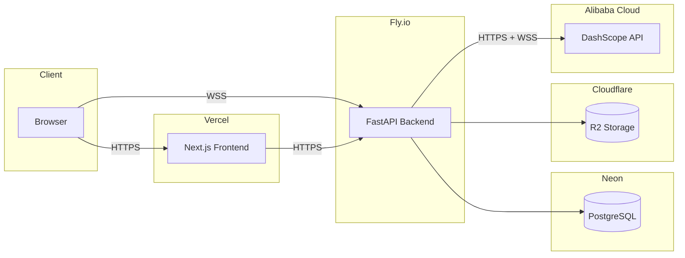

# Deployment Guide

Deploy Tocky with **Vercel** (frontend), **Fly.io** (backend), **Cloudflare R2** (audio storage), and **Alibaba DashScope** (AI).

## Overview



> Vercel does not proxy WebSocket connections. The browser connects directly to Fly.io for live scribe sessions via `NEXT_PUBLIC_WS_URL`.

## 1. Prerequisites

- GitHub repo with the Tocky codebase pushed
- Accounts: [Vercel](https://vercel.com), [Fly.io](https://fly.io), [Cloudflare](https://dash.cloudflare.com), [Alibaba Cloud](https://www.alibabacloud.com)
- [flyctl](https://fly.io/docs/flyctl/install/) CLI installed locally

**Generate ES256 ECDSA key pair** (for JWT auth):

```bash
openssl ecparam -genkey -name prime256v1 -noout -out private.pem
openssl ec -in private.pem -pubout -out public.pem
```

Keep both files — you'll paste their contents into environment variables.

## 2. Cloudflare R2 Setup

1. Go to [Cloudflare Dashboard](https://dash.cloudflare.com) → **R2 Object Storage**
2. **Create a bucket** named `tocky-audio`
3. Go to **R2** → **Manage R2 API Tokens** → **Create API token**
   - Permissions: **Object Read & Write**
   - Specify bucket: `tocky-audio`
4. Note these values:
   ```
   TOCKY_S3_ENDPOINT_URL=https://<account-id>.r2.cloudflarestorage.com
   TOCKY_S3_ACCESS_KEY_ID=<from token>
   TOCKY_S3_ACCESS_KEY_SECRET=<from token>
   TOCKY_S3_BUCKET_NAME=tocky-audio
   TOCKY_S3_REGION=auto
   ```

> Your **Account ID** is in the Cloudflare dashboard URL or on the R2 overview page.

## 3. DashScope Setup

1. Enable [DashScope](https://dashscope.console.aliyun.com/) in Alibaba Cloud console
2. Go to **API Keys** → **Create API Key**
3. Enable required models in the model gallery:
   - `qwen3-asr-flash` (batch transcription)
   - `qwen3-asr-flash-realtime` (streaming ASR)
   - `qwen3.5-flash` (classification, extraction)
   - `qwen3.5-plus` (SOAP generation)
4. Note the regional endpoints:
   - International: `https://dashscope-intl.aliyuncs.com/compatible-mode/v1` and `wss://dashscope-intl.aliyuncs.com`
   - China: `https://dashscope.aliyuncs.com/compatible-mode/v1` and `wss://dashscope.aliyuncs.com`

## 4. Neon PostgreSQL Setup

1. Go to [neon.tech](https://neon.tech) → **Sign up** → **Create a project**
   - Name: `tocky`
   - Region: pick one close to your Fly.io region (e.g., Singapore or AWS ap-southeast-1)
2. Neon creates a default `main` branch and database. Go to **Dashboard** → **Connection Details**
3. Copy the connection string and change the scheme to asyncpg:
   ```
   postgresql+asyncpg://neondb_owner:<pass>@<host>.neon.tech/neondb?sslmode=require
   ```
4. Enable the `pg_trgm` extension via the **SQL Editor** in Neon console:
   ```sql
   CREATE EXTENSION IF NOT EXISTS pg_trgm;
   ```

> Neon's free tier includes 0.5 GB storage and autoscales to zero when idle. Connections resume in ~500ms on first request.

## 5. Fly.io Setup

### Install flyctl and Login

```bash
# macOS
brew install flyctl

# or via install script
curl -L https://fly.io/install.sh | sh

# Login
fly auth login
```

### Create the App

```bash
cd apps/api
fly apps create tocky-api --machines
```

> The `fly.toml` is already included in the repo at `apps/api/fly.toml`. It configures the region (`sin` — Singapore), health checks, and a release command that runs migrations before each deploy.

### Set Environment Variables

```bash
fly secrets set --app tocky-api \
  TOCKY_DEBUG=false \
  TOCKY_DATABASE_URL="postgresql+asyncpg://neondb_owner:<pass>@<host>.neon.tech/neondb?sslmode=require" \
  TOCKY_JWT_PRIVATE_KEY="$(cat private.pem)" \
  TOCKY_JWT_PUBLIC_KEY="$(cat public.pem)" \
  TOCKY_DASHSCOPE_API_KEY="<your-key>" \
  TOCKY_DASHSCOPE_BASE_URL="https://dashscope-intl.aliyuncs.com/compatible-mode/v1" \
  TOCKY_DASHSCOPE_WS_BASE_URL="wss://dashscope-intl.aliyuncs.com" \
  TOCKY_QWEN_MODEL_NAME="qwen2.5-omni-7b" \
  TOCKY_QWEN_TRANSCRIPTION_MODEL="qwen3-asr-flash" \
  TOCKY_QWEN_STREAMING_ASR_MODEL="qwen3-asr-flash-realtime" \
  TOCKY_QWEN_CLASSIFICATION_MODEL="qwen3.5-flash" \
  TOCKY_QWEN_SOAP_MODEL="qwen3.5-plus" \
  TOCKY_QWEN_EXTRACTION_MODEL="qwen3.5-flash" \
  TOCKY_S3_ENDPOINT_URL="https://<account-id>.r2.cloudflarestorage.com" \
  TOCKY_S3_ACCESS_KEY_ID="<r2-access-key>" \
  TOCKY_S3_ACCESS_KEY_SECRET="<r2-secret-key>" \
  TOCKY_S3_BUCKET_NAME="tocky-audio" \
  TOCKY_S3_REGION="auto" \
  TOCKY_SANDBOX_AI=false
```

### First Deploy

```bash
cd apps/api
fly deploy
```

Fly builds the Dockerfile remotely, runs `uv run alembic upgrade head` (the release command in `fly.toml`), then starts the server. Prompt templates auto-seed on first startup.

Your app will be available at `https://tocky-api.fly.dev` (or the name you chose). HTTPS and WSS work automatically.

### Get Fly API Token (for GitHub Actions)

```bash
fly tokens create deploy --app tocky-api
```

Copy the token — you'll add it as a GitHub secret.

## 6. Vercel Setup

### Create the Project

1. Go to [vercel.com/new](https://vercel.com/new) → **Import Git Repository**
2. Select your Tocky repository
3. Configure:
   - **Root Directory**: `.` (project root)
   - **Framework Preset**: Next.js
   - **Build Command**: `cd apps/web && pnpm build`
   - **Install Command**: `pnpm install`

### Configure Environment Variables

In Vercel project → **Settings** → **Environment Variables**, add:

| Variable | Value |
|----------|-------|
| `NEXT_PUBLIC_API_URL` | `https://tocky-api.fly.dev` (your Fly.io URL) |
| `NEXT_PUBLIC_WS_URL` | `wss://tocky-api.fly.dev` (same host, wss scheme) |
| `NEXT_PUBLIC_JWT_PUBLIC_KEY` | Contents of `public.pem` |

### Get Vercel IDs (for GitHub Actions)

1. Install Vercel CLI: `pnpm add -g vercel`
2. Link your project locally:
   ```bash
   cd /path/to/tocky
   vercel link
   ```
3. This creates `.vercel/project.json` with `orgId` and `projectId`
4. Create an API token at [vercel.com/account/tokens](https://vercel.com/account/tokens)

### Notes

- The `rewrites` in `next.config.mjs` (proxying `/api/v1/*` to localhost) only apply in development. In production, API calls go directly to `NEXT_PUBLIC_API_URL`.
- WebSocket connections go directly from the browser to Fly.io — Vercel is not involved.

## 7. GitHub Actions Setup

### Add Secrets

Go to your GitHub repo → **Settings** → **Secrets and variables** → **Actions** → **New repository secret**:

| Secret | Value | How to get it |
|--------|-------|---------------|
| `FLY_API_TOKEN` | Fly.io deploy token | `fly tokens create deploy --app tocky-api` |
| `VERCEL_TOKEN` | Vercel API token | [vercel.com/account/tokens](https://vercel.com/account/tokens) |
| `VERCEL_ORG_ID` | Vercel org/team ID | `.vercel/project.json` after `vercel link` |
| `VERCEL_PROJECT_ID` | Vercel project ID | `.vercel/project.json` after `vercel link` |

### How Deploys Trigger

| Workflow | Trigger | What it deploys |
|----------|---------|-----------------|
| `deploy-api.yml` | Push to `main` changing `apps/api/**` | Backend to Fly.io |
| `deploy-web.yml` | Push to `main` changing `apps/web/**` or `packages/**` | Frontend to Vercel |

Both can also be triggered manually via **Actions** → **Run workflow**.

## 8. Code Changes Required Before Deploy

Two values are hardcoded for development:

**1. CORS origins** (`apps/api/app/main.py`):

Currently hardcoded to `http://localhost:3000`. Parameterize via env var:
```python
# In config.py, add:
cors_origins: str = "http://localhost:3000"  # comma-separated

# In main.py, change to:
app.add_middleware(
    CORSMiddleware,
    allow_origins=settings.cors_origins.split(","),
    ...
)
```
Then set `TOCKY_CORS_ORIGINS` on Fly.io:
```bash
fly secrets set TOCKY_CORS_ORIGINS="https://tocky.vercel.app" --app tocky-api
```

**2. Cookie security** (`apps/api/app/routers/auth.py`):

Currently `COOKIE_SECURE = False`. Make env-dependent:
```python
# In config.py, add:
cookie_secure: bool = False

# In auth.py, change to:
COOKIE_SECURE = get_settings().cookie_secure
```
Then set on Fly.io:
```bash
fly secrets set TOCKY_COOKIE_SECURE=true --app tocky-api
```

> If frontend and backend are on different domains, also change `COOKIE_SAMESITE` from `"lax"` to `"none"` (requires `Secure=True`).

## 9. Post-Deployment Checklist

- [ ] `GET https://tocky-api.fly.dev/health` returns 200
- [ ] Sign up, sign in, sign out — cookies set correctly
- [ ] Create consultation — appears in dashboard
- [ ] WebSocket scribe — start recording, transcript segments appear
- [ ] Stop recording — SOAP note generated with all 4 sections
- [ ] Upload audio file — SSE progress events stream, SOAP generated
- [ ] ICD-10 search returns results
- [ ] Admin panel loads (user list, quality metrics)
- [ ] `tocky_access` cookie has `Secure` and `HttpOnly` flags

## 10. Monitoring

### Health Checks

Fly.io runs health checks automatically as configured in `fly.toml` (`GET /health` every 30s).

### DashScope Quotas

Each consultation makes multiple AI calls (transcription, classification per segment, polishing, extraction, SOAP generation, review, ICD-10). Monitor usage in the [DashScope console](https://dashscope.console.aliyun.com/).

### R2 Storage

Free tier: 10 GB storage, 10M Class A operations/month, 1M Class B operations/month. Each consultation stores ~2 MB/min of audio. Monitor usage in the Cloudflare dashboard under **R2**.

### Logging

View logs with `fly logs --app tocky-api` or in the Fly.io dashboard. The backend uses Python logging (`TOCKY_DEBUG=false` sets INFO level). For production, consider adding Sentry for error tracking.
