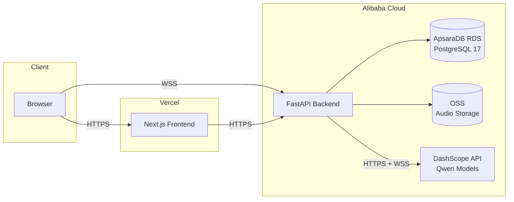

# Deployment Guide

This guide covers deploying Tocky to production with the **frontend on Vercel** and the **backend on Alibaba Cloud**.

## Overview



The frontend connects to the backend for REST API calls (`HTTPS`) and WebSocket audio streaming (`WSS`). The backend connects to DashScope for AI inference, OSS for audio storage, and PostgreSQL for persistence.

> **Note:** Vercel does not proxy WebSocket connections. The browser connects directly to the backend for WebSocket (live scribe) sessions. The `rewrites` in `next.config.mjs` are dev-only.

## Prerequisites

**Accounts:**
- [Vercel](https://vercel.com) account (free tier works for getting started)
- [Alibaba Cloud](https://www.alibabacloud.com) account with billing enabled

**Tools (local):**
- Git
- Node.js >= 20 & [pnpm](https://pnpm.io/)
- Python 3.13 & [uv](https://docs.astral.sh/uv/)
- Docker (for building backend image)
- [OpenSSL](https://www.openssl.org/) (for key generation)

**Generate ES256 ECDSA key pair:**
```bash
openssl ecparam -genkey -name prime256v1 -noout -out private.pem
openssl ec -in private.pem -pubout -out public.pem
```

Keep both files — you'll paste their contents into environment variables.

## Alibaba Cloud Infrastructure

### PostgreSQL (ApsaraDB RDS)

1. Create an **ApsaraDB RDS for PostgreSQL** instance (version 17+)
2. Create database `tocky` and user `tocky` with full privileges
3. Enable the `pg_trgm` extension (required for ICD-10 similarity search):
   ```sql
   CREATE EXTENSION IF NOT EXISTS pg_trgm;
   ```
4. Note the connection endpoint — you'll need it for `TOCKY_DATABASE_URL`:
   ```
   postgresql+asyncpg://tocky:<password>@<rds-endpoint>:5432/tocky
   ```
5. Configure the security group / VPC whitelist to allow connections from your compute instances

### Object Storage Service (OSS)

1. Create an OSS bucket (e.g., `tocky-audio`)
2. Choose a region close to your compute instances for low latency
3. Set bucket ACL to **private** (all access via signed URLs)
4. Create a RAM user with `AliyunOSSFullAccess` policy (or a scoped custom policy for the bucket)
5. Generate an AccessKey pair for the RAM user
6. Note the following for environment variables:
   - `TOCKY_OSS_ENDPOINT` — e.g., `oss-ap-southeast-1.aliyuncs.com`
   - `TOCKY_OSS_ACCESS_KEY_ID`
   - `TOCKY_OSS_ACCESS_KEY_SECRET`
   - `TOCKY_OSS_BUCKET_NAME` — e.g., `tocky-audio`

### DashScope API

1. Enable [DashScope](https://dashscope.console.aliyun.com/) in your Alibaba Cloud console
2. Generate an API key
3. Enable the required models:
   - `qwen3-asr-flash` (batch transcription)
   - `qwen3-asr-flash-realtime` (streaming ASR)
   - `qwen3.5-flash` (classification, extraction)
   - `qwen3.5-plus` (SOAP generation)
4. Choose the regional endpoint:
   - International (Singapore): `https://dashscope-intl.aliyuncs.com/compatible-mode/v1`
   - China (Beijing): `https://dashscope.aliyuncs.com/compatible-mode/v1`
5. WebSocket endpoint (for streaming ASR):
   - International: `wss://dashscope-intl.aliyuncs.com`
   - China: `wss://dashscope.aliyuncs.com`

## Backend Deployment (Alibaba Cloud)

### Dockerfile

Create `apps/api/Dockerfile`:

```dockerfile
FROM python:3.13-slim

# Install system dependencies
RUN apt-get update && apt-get install -y --no-install-recommends \
    ffmpeg \
    && rm -rf /var/lib/apt/lists/*

# Install uv
COPY --from=ghcr.io/astral-sh/uv:latest /uv /usr/local/bin/uv

WORKDIR /app

# Install Python dependencies
COPY pyproject.toml uv.lock ./
RUN uv sync --frozen --no-dev --no-install-project

# Copy application code
COPY app/ app/
COPY prompts/ prompts/
COPY alembic/ alembic/
COPY alembic.ini .

EXPOSE 8000

CMD ["uv", "run", "uvicorn", "app.main:app", "--host", "0.0.0.0", "--port", "8000"]
```

> **Note:** `ffmpeg` is required for audio format conversion (mp3/m4a/ogg → PCM).

### Code Changes Required Before Deploy

Two values are currently hardcoded for development and **must be parameterized** for production:

**1. CORS origins** (`apps/api/app/main.py:122-129`):

Currently hardcoded to `http://localhost:3000`. Change to read from an environment variable:
```python
# In config.py, add:
cors_origins: str = "http://localhost:3000"  # comma-separated origins

# In main.py, change to:
app.add_middleware(
    CORSMiddleware,
    allow_origins=settings.cors_origins.split(","),
    ...
)
```
Set `TOCKY_CORS_ORIGINS` to your Vercel domain (e.g., `https://tocky.example.com`).

**2. Cookie security** (`apps/api/app/routers/auth.py:28`):

Currently `COOKIE_SECURE = False`. Change to environment-driven:
```python
# In config.py, add:
cookie_secure: bool = False

# In auth.py, read from settings:
COOKIE_SECURE = get_settings().cookie_secure
```
Set `TOCKY_COOKIE_SECURE=true` in production (requires HTTPS).

> If frontend and backend are on different domains, you may also need to change `COOKIE_SAMESITE` from `"lax"` to `"none"` (which requires `Secure=True`).

### Build and Push

```bash
cd apps/api

# Build the Docker image
docker build -t tocky-api:latest .

# Tag for Alibaba Container Registry (ACR)
docker tag tocky-api:latest registry.<region>.aliyuncs.com/<namespace>/tocky-api:latest

# Login to ACR
docker login --username=<ram-user> registry.<region>.aliyuncs.com

# Push
docker push registry.<region>.aliyuncs.com/<namespace>/tocky-api:latest
```

### Deployment Options

#### Option A: ECS (Elastic Compute Service) — Simplest

Best for small teams getting started.

1. Create an ECS instance (2+ vCPU, 4+ GB RAM recommended)
2. Install Docker on the instance
3. Pull and run the container:
   ```bash
   docker pull registry.<region>.aliyuncs.com/<namespace>/tocky-api:latest
   docker run -d \
     --name tocky-api \
     --restart unless-stopped \
     -p 8000:8000 \
     --env-file .env.production \
     tocky-api:latest
   ```
4. Set up a reverse proxy (nginx) for TLS termination:
   ```nginx
   server {
       listen 443 ssl;
       server_name api.tocky.example.com;

       ssl_certificate /path/to/cert.pem;
       ssl_certificate_key /path/to/key.pem;

       location / {
           proxy_pass http://127.0.0.1:8000;
           proxy_set_header Host $host;
           proxy_set_header X-Real-IP $remote_addr;
           proxy_set_header X-Forwarded-For $proxy_add_x_forwarded_for;
           proxy_set_header X-Forwarded-Proto $scheme;
       }

       # WebSocket support
       location /ws/ {
           proxy_pass http://127.0.0.1:8000;
           proxy_http_version 1.1;
           proxy_set_header Upgrade $http_upgrade;
           proxy_set_header Connection "upgrade";
           proxy_set_header Host $host;
           proxy_read_timeout 3600s;
       }
   }
   ```

#### Option B: SAE (Serverless App Engine) — Auto-Scaling

Container-based serverless platform with auto-scaling.

1. Create an SAE application with the container image from ACR
2. Configure environment variables in the SAE console
3. Set minimum instances to 1 (WebSocket connections require a persistent instance)
4. Configure health check: `GET /health`
5. Set up SLB (Server Load Balancer) for custom domain + TLS

> **Important:** SAE instances can scale to zero, which drops WebSocket connections. Keep at least 1 instance running if live scribe sessions are expected.

#### Option C: ACK (Kubernetes) — Production-Grade

For larger teams with Kubernetes expertise.

1. Create an ACK cluster
2. Deploy with a Kubernetes manifest (Deployment + Service + Ingress)
3. Use nginx-ingress or ALB Ingress Controller for TLS and WebSocket support
4. Configure HPA (Horizontal Pod Autoscaler) based on CPU/connections

### Environment Variables

Full list of backend environment variables for production:

| Variable | Required | Production Value |
|----------|----------|-----------------|
| `TOCKY_DEBUG` | Yes | `false` |
| `TOCKY_DATABASE_URL` | Yes | `postgresql+asyncpg://tocky:<pass>@<rds-endpoint>:5432/tocky` |
| `TOCKY_JWT_PRIVATE_KEY` | Yes | Contents of `private.pem` |
| `TOCKY_JWT_PUBLIC_KEY` | Yes | Contents of `public.pem` |
| `TOCKY_DASHSCOPE_API_KEY` | Yes | Your DashScope API key |
| `TOCKY_DASHSCOPE_BASE_URL` | Yes | `https://dashscope-intl.aliyuncs.com/compatible-mode/v1` |
| `TOCKY_DASHSCOPE_WS_BASE_URL` | Yes | `wss://dashscope-intl.aliyuncs.com` |
| `TOCKY_QWEN_MODEL_NAME` | No | `qwen2.5-omni-7b` (fallback) |
| `TOCKY_QWEN_TRANSCRIPTION_MODEL` | No | `qwen3-asr-flash` |
| `TOCKY_QWEN_STREAMING_ASR_MODEL` | No | `qwen3-asr-flash-realtime` |
| `TOCKY_QWEN_CLASSIFICATION_MODEL` | No | `qwen3.5-flash` |
| `TOCKY_QWEN_SOAP_MODEL` | No | `qwen3.5-plus` |
| `TOCKY_QWEN_EXTRACTION_MODEL` | No | `qwen3.5-flash` |
| `TOCKY_VAD_THRESHOLD` | No | `0.5` |
| `TOCKY_VAD_SILENCE_DURATION_MS` | No | `1200` |
| `TOCKY_VAD_PREFIX_PADDING_MS` | No | `300` |
| `TOCKY_OSS_ACCESS_KEY_ID` | Yes | Your OSS access key |
| `TOCKY_OSS_ACCESS_KEY_SECRET` | Yes | Your OSS secret key |
| `TOCKY_OSS_BUCKET_NAME` | Yes | `tocky-audio` |
| `TOCKY_OSS_ENDPOINT` | Yes | e.g., `oss-ap-southeast-1.aliyuncs.com` |
| `TOCKY_SANDBOX_AI` | Yes | `false` |
| `TOCKY_CORS_ORIGINS` | Yes | `https://tocky.example.com` (after code change) |
| `TOCKY_COOKIE_SECURE` | Yes | `true` (after code change) |

### Database Migration

Run migrations before starting the application (or as an init step):

```bash
# Via SSH on ECS:
docker exec tocky-api uv run alembic upgrade head

# Or as a one-off container:
docker run --rm --env-file .env.production tocky-api:latest \
  uv run alembic upgrade head
```

Prompt templates are auto-seeded from `prompts/` on first application startup — no manual seeding required.

## Frontend Deployment (Vercel)

### Project Setup

1. Import the repository in the [Vercel dashboard](https://vercel.com/new)
2. Vercel auto-detects the Turborepo monorepo structure
3. Configure the project:
   - **Root directory**: `.` (project root — Vercel uses Turbo to resolve workspace dependencies)
   - **Framework preset**: Next.js
   - **Build command**: `cd apps/web && pnpm build`
   - **Output directory**: `apps/web/.next`
   - **Install command**: `pnpm install`

### Environment Variables

Set these in the Vercel project settings:

| Variable | Value |
|----------|-------|
| `NEXT_PUBLIC_API_URL` | `https://api.tocky.example.com` |
| `NEXT_PUBLIC_WS_URL` | `wss://api.tocky.example.com` |
| `NEXT_PUBLIC_JWT_PUBLIC_KEY` | Contents of `public.pem` |

### Notes

- **WebSocket:** The browser connects directly to the backend at `NEXT_PUBLIC_WS_URL` for live scribe sessions. Vercel does not proxy WebSocket connections, and this is already how the frontend code works.
- **API rewrites:** The `rewrites` in `next.config.mjs` (proxying `/api/v1/*` to `localhost:8000`) only apply in development. In production, the frontend's `api.ts` client sends requests directly to `NEXT_PUBLIC_API_URL`.
- **Monorepo:** Vercel auto-detects Turborepo. You can scope builds to the `web` package by setting a [root directory filter](https://vercel.com/docs/monorepos/turborepo) if needed.

## Domain and TLS

### Frontend (Vercel)

Vercel provides automatic TLS for custom domains. Add your domain (e.g., `tocky.example.com`) in the Vercel project settings and configure DNS as instructed.

### Backend (Alibaba Cloud)

For the backend domain (e.g., `api.tocky.example.com`):

- **ECS with nginx:** Obtain a TLS certificate (Let's Encrypt or Alibaba Cloud SSL Certificates) and configure nginx as shown in the ECS section above. Ensure the nginx config supports WebSocket upgrade for `/ws/` paths.
- **SAE/ACK with SLB:** Configure a Server Load Balancer (SLB) with HTTPS listener and your TLS certificate. Enable WebSocket support on the listener.
- Ensure `wss://` works end-to-end — the browser uses `NEXT_PUBLIC_WS_URL` for WebSocket connections.

## Post-Deployment Checklist

- [ ] **Health check:** `GET https://api.tocky.example.com/health` returns `200`
- [ ] **Auth flow:** Sign up, sign in, sign out — cookies set correctly over HTTPS
- [ ] **Token refresh:** Access token expires and refreshes transparently
- [ ] **Create consultation:** New consultation appears in dashboard
- [ ] **WebSocket scribe:** Start recording, verify audio streams and transcript segments appear
- [ ] **SOAP generation:** Stop recording, verify SOAP note is generated with all 4 sections
- [ ] **Batch upload:** Upload an audio file, verify SSE progress events and SOAP generation
- [ ] **ICD-10 search:** Search for a code, verify results return
- [ ] **Admin panel:** Access admin dashboard, verify user list and quality metrics load
- [ ] **CORS:** Frontend can make API calls without CORS errors
- [ ] **Cookies:** `tocky_access` cookie has `Secure` and `HttpOnly` flags in browser devtools

## Monitoring and Operations

### Health Checks

The `/health` endpoint returns the API status. Configure your load balancer or monitoring service to poll it regularly.

> The current health check is a simple liveness probe. For production readiness, consider enhancing it to verify database connectivity and DashScope API availability.

### Logging

The backend uses Python's built-in `logging` module with configurable level (`TOCKY_DEBUG=false` sets INFO level). For production, consider:
- Structured JSON logging for integration with log aggregation services
- Request ID correlation across API calls
- Error tracking integration (e.g., Sentry)

### DashScope Quotas

Monitor your DashScope API usage — each consultation involves multiple AI calls (transcription, classification per segment, polishing, entity extraction, SOAP generation, review, ICD-10 suggestion). Check rate limits and quotas in the [DashScope console](https://dashscope.console.aliyun.com/).

### OSS Storage

Audio files accumulate over time. Consider:
- Setting up lifecycle rules to move old audio to Infrequent Access (IA) storage class
- Monitoring bucket size and setting alerts
- Each consultation stores: PCM checkpoint (~32KB/sec of audio) + full WAV + individual audio segments
